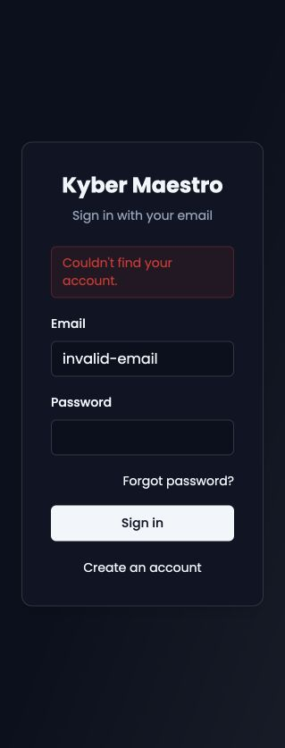
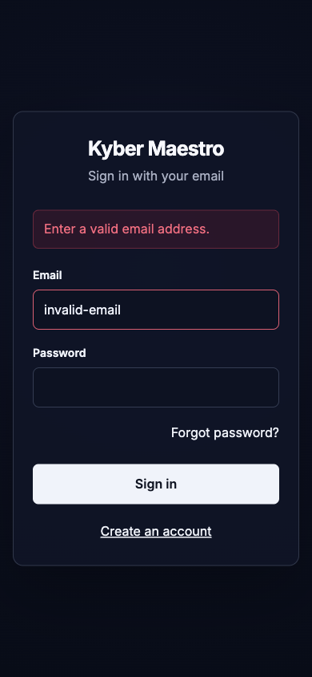
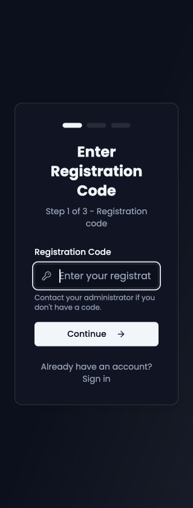
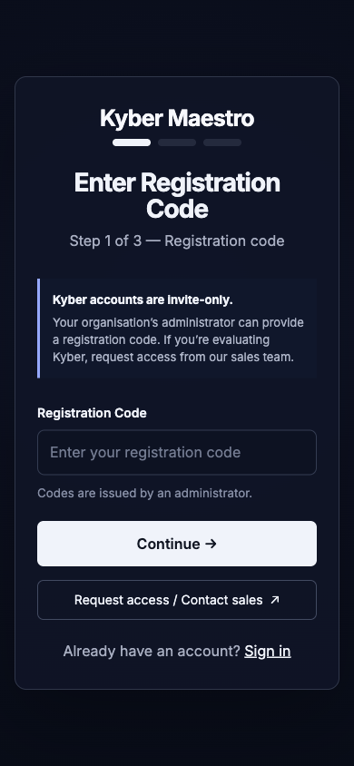
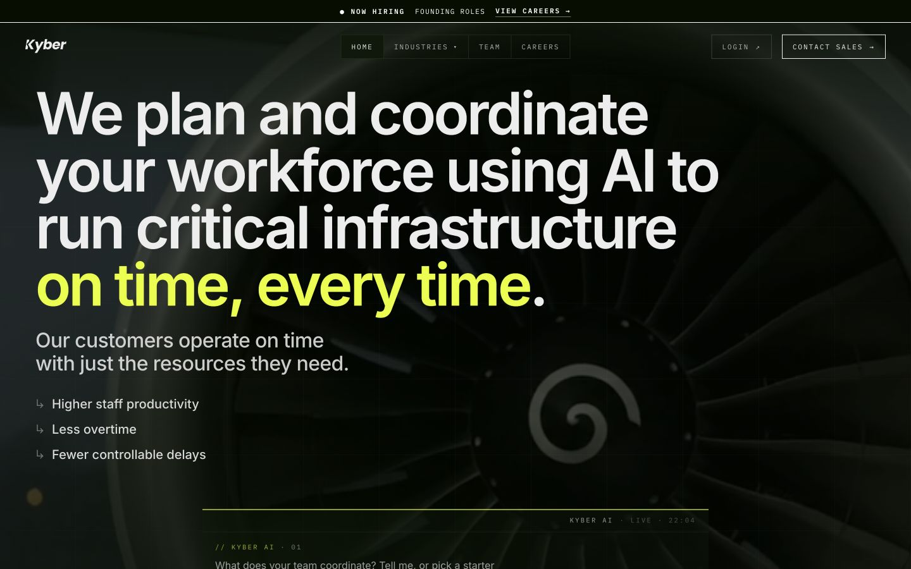
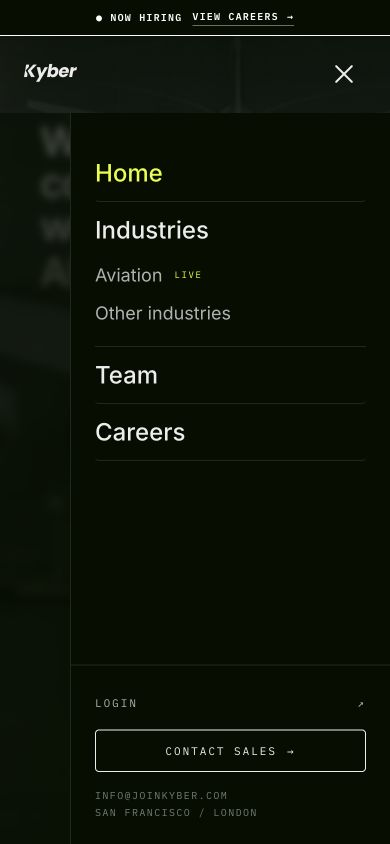
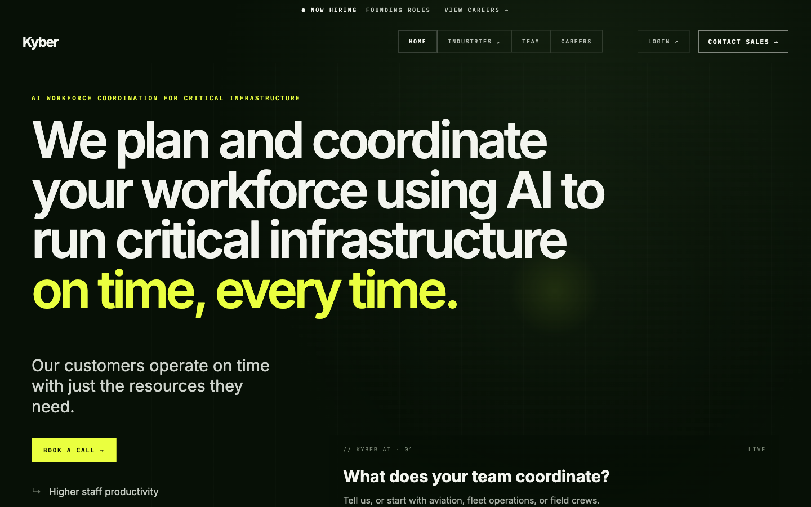
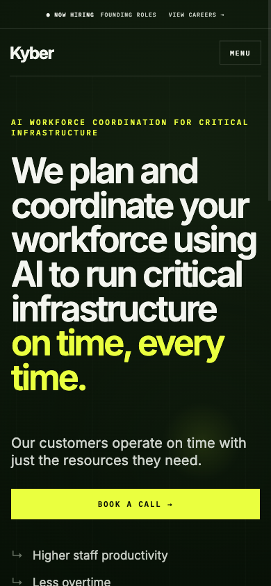
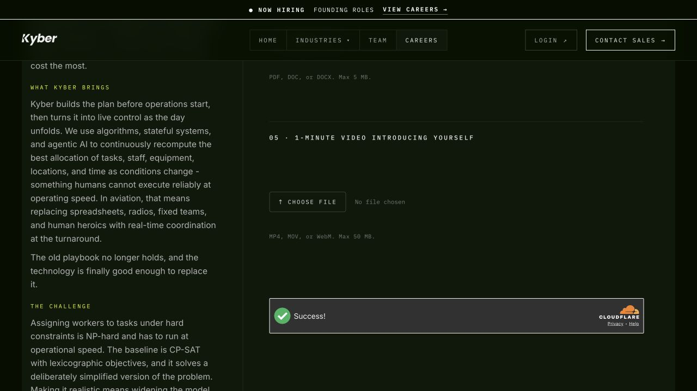
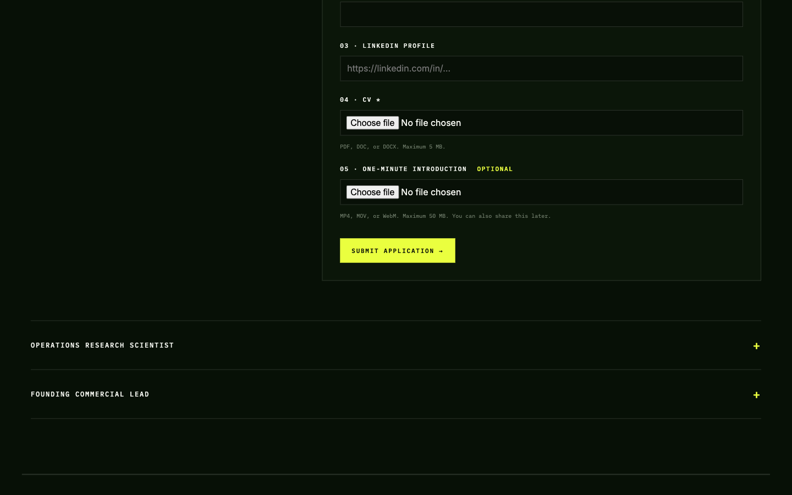

# Kyber local website and app

## QA fixes — before vs. after

| Flow | Before | After |
| --- | --- | --- |
| **1. Password recovery** | Malformed email triggered account lookup, showed “Couldn't find your account,” and reused Sign in loading.<br><br> | Format is checked before the request; recovery has its own loading text; stale errors clear on edit; empty validation still works.<br><br> |
| **2. Registration code gate** | Invite code was required without a request-access or sales path.<br><br> | Invite-only policy is explicit and **Request access / Contact sales** is available; the code requirement remains enforced.<br><br> |
| **3. Homepage sales CTA** | Booking lived in the desktop header or mobile Menu, away from the value proposition.<br><br><br> | **Book a call** now appears in the hero on desktop and 390 px mobile, using the existing calendar destination.<br><br><br> |
| **4. Career application** | CV and one-minute video were both required at the first step.<br><br> | CV stays required; video is optional, its purpose is explained, and type/50 MB validation is preserved when supplied.<br><br> |

See the [concise QA evidence and verification notes](docs/qa/README.md). No
production submission or deployment is implied by these local after-states.

This workspace contains two Vite applications and a Fastify backend:

- `website` — the public marketing site (`http://localhost:4173`)
- `app` — authentication and invite-only registration (`http://localhost:4174`)
- `backend` — Fastify API and background worker (`http://localhost:4175`)

The lightweight local setup keeps PostgreSQL, Redis, and Mailpit in Docker while
the API uses signed uploads in the private `backend/.data` directory:

```bash
docker compose up -d postgres redis mailpit
npm run build --workspace backend
npm run migrate
npm run start --workspace backend
# in another terminal
npm run start:worker --workspace backend
```

Run `npm run dev:website` and `npm run dev:app` in separate terminals. Run all
regression tests with `npm test` and production builds with `npm run build`.
With the API, worker, Postgres, Redis, and Mailpit running, execute the full
black-box journey with `npm run test:integration`.

The production-like profile switches to S3-compatible private storage and
ClamAV. It is larger and requires sufficient Docker Desktop image storage:

```bash
docker compose --profile full up --build
```

For an actual production deployment, set `NODE_ENV=production` and provide
every secret and encrypted-service setting explicitly. Startup fails if local
credentials, HTTP origins, non-TLS database/Redis/storage/SMTP connections,
disabled malware scanning, or disabled email verification are detected.
Production migrations do not run from API replicas; run `npm run migrate` as a
separate release step.

The provider-neutral staging definition is in
[`deploy/staging`](deploy/staging/README.md). Pull requests and `main` pushes
also run unit tests, builds, dependency and secret scanning, container scanning,
migrations, and the black-box journey through `.github/workflows/ci.yml`.
CodeQL adds static analysis, while repository vulnerability alerts flag known
dependency risk without opening update pull requests.
GitHub Actions and container base images are pinned to immutable commits or
manifest digests. Dependency and action upgrades are tested and committed
directly to `main` under the repository's direct-update policy.

Additional release gates are available as `npm run load:smoke`,
`npm run backup:verify`, `npm run sbom`, and `npm run release:manifest`.
Use `npm run deploy:preflight -- /absolute/path/to/staging.env` before a
deployment and `npm run staging:smoke -- --website ... --app ... --api ...`
afterward.
Production-style frontend images are defined in `website/Dockerfile` and
`app/Dockerfile`; both serve SPA routes from an unprivileged Nginx process with
security and cache headers.

The manual `Publish release images` workflow is registry-neutral. Configure its
protected `release` environment with `REGISTRY_USERNAME` and
`REGISTRY_PASSWORD`, then supply the registry, namespace, immutable tag, and
public HTTPS API URL. It publishes SBOM/provenance metadata, attestations, and a
digest manifest; deployments should consume those digests. The complete human
approval and staging gates are in [`deploy/RELEASE_CHECKLIST.md`](deploy/RELEASE_CHECKLIST.md).

Local service URLs:

- Mailpit inbox: `http://localhost:8025`
- S3-compatible storage endpoint in the `full` profile: `http://localhost:9000`
- API readiness: `http://localhost:4175/health/ready`

The seeded development registration code is `KYBER-LOCAL-2026`. A seeded test account
is available at `local@joinkyber.test` with password `KyberLocal!2026` when the
API runs in development mode. Change or remove both before any deployment.

All account, recovery, email, and application data stays local. The lightweight
worker performs a non-empty-file/EICAR safety check; use the `full` profile for
ClamAV scanning. Booking continues to use Kyber's existing Google Calendar
link. Chat is still a local frontend preview and does not submit messages.

Hardening included in the API:

- production configuration guardrails and host-only secure session cookies;
- explicit trusted-proxy and browser-origin allowlists;
- secret-safe request logging, security headers, no-store auth responses, and
  global request limits;
- authenticated session inspection and revocation;
- single-use email verification and password-reset tokens;
- a transactional PostgreSQL outbox for email and file-scan jobs;
- periodic cleanup of expired sessions, tokens, drafts, uploads, and delivered
  outbox records.
